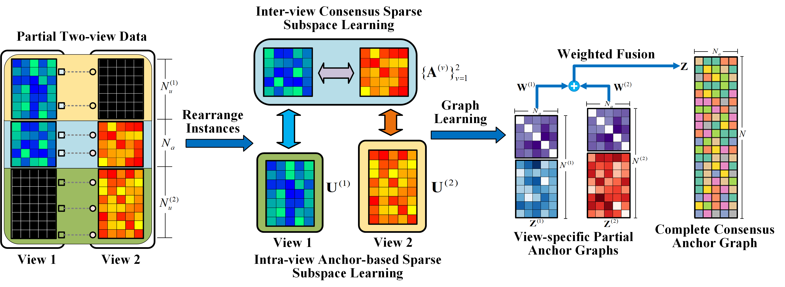

# abs2imc.pytorch



## Introduction

This is the official PyTorch implementation of Anchor-based Sparse Subspace Incomplete Multi-view Clustering (ABS2IMC).

> Anchor-based Sparse Subspace Incomplete Multi-view Clustering
> Ao Li, Cong Feng, Zhuo Wang, Yuegong Sun, Zizhen Wang, Ling Sun, 2022, Wireless Networks, under review.

### Abstract

We propose a novel Anchor-based Sparse Subspace Incomplete Multi-view Clustering solution to address the Incomplete Multi-view Clustering problem. Through a unified sparse subspace learning framework, the proposed method learns inter-view anchor-to-anchor and intra-view anchor-to-incomplete affinities and fuses them into a consensus sparse anchor graph, which yields a unified clustering result. Our method outperforms other incomplete multi-view clustering methods in three important ways:1) it uses a small number of hyperparameters to learn a sparse consensus graph from the data; 2) Because of the anchor-based graph construction, it can process large datasets; 3) It is naturally capable of handling both negative entries and multiple views.


### Install & Run

```
pip install -r requirements.txt
python main.py
```

### Documentation

Please see the [English version](docs/formula-en.md) or [中文版文档](docs/formula-zh.md) for the details of our method.


## Acknowledge

This work is mainly inspired by:
1. Guo, J. and Jiahui Ye. “Anchors Bring Ease: An Embarrassingly Simple Approach to Partial Multi-View Clustering.” AAAI Conference on Artificial Intelligence (2019).
2. Zhao Kang, Wangtao Zhou, Zhitong Zhao, Junming Shao, Meng Han, Zenglin Xu:
Large-scale Multi-view Subspace Clustering in Linear Time. CoRR abs/1911.09290 (2019)


## Citation

If you find this work useful, please cite us as follows:

> Anchor-based Sparse Subspace Incomplete Multi-view Clustering
> Ao Li, Cong Feng, Zhuo Wang, Yuegong Sun, Zizhen Wang, Ling Sun, 2022, Wireless Networks, under review.
